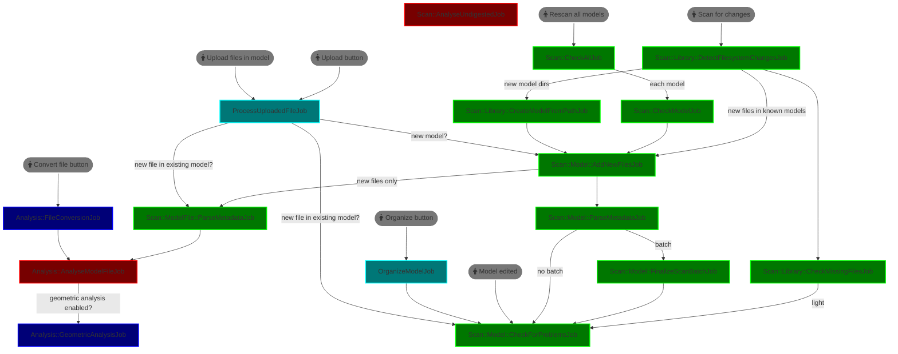

# Scanning jobs

Incremental, batched scan pipeline. **Only new/changed work is expensive.**

## Design rules

1. **Scan for changes** discovers new model dirs (bounded depth, default `SCAN_MAX_DEPTH=6`) and shallow-checks **known models** for new files. Missing files are handled by `CheckMissingFilesJob` (batched), not a full re-scan loop.
2. **AddNewFiles** only enqueues file metadata/analysis for *newly created* `ModelFile` rows — never re-parses the whole model.
3. **Rescan all models** syncs filesystem + problem checks. It does **not** re-analyse every mesh (`deep: true` is opt-in on `CheckModelJob`).
4. **Analysis** (digest, duplicates, manifold) runs for new files only, or when `deep: true`, or via Phase B `AnalyseUndigestedJob` / `rake manyfold:analyse_undigested`.
5. Scan jobs set explicit `lock_ttl`. Stuck locks: `Scan::Library::DetectFilesystemChangesJob.unlock!` (or `ActiveJob::Uniqueness.unlock!`).

### Queues

* Green: `scan` — filesystem sync, metadata, problems
* Red: `analysis` / `low` — digests and file analysis
* Cyan: `default` — upload / organize
* Blue: `performance` — heavy mesh work (concurrency 1)

Grey ovals are user-initiated actions.
