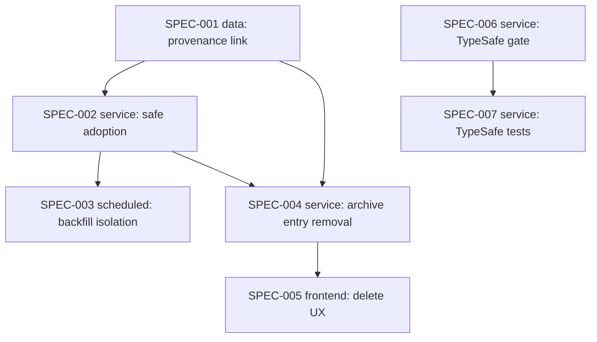

# Initiative: Archive image adoption hardening + spark-curate merge-gate fixes

**Initiative ID:** INIT-001
**Status:** planned
**Slug:** INIT-001-archive-adoption-and-merge-gate-fixes
**Discipline Profile:** `software`
**Created:** 2026-10-07
**Owner:** Brian Nelson
**Ticket:** None (`branch_naming.ticket_system: none`)
**Branch:** `archive-adoption-and-merge-gate-fixes` (deliberately not a worktree — these fixes layer on uncommitted work-in-progress on `main` that a fresh worktree would not contain; commit that WIP to this branch before executing SPEC-001)
**Target Completion:** 2026-10-14
**Source:** `sdd/reviews/main-uncommitted/code-review-findings-2026-10-07.md` (CRIT-1, MAJ-1 … MAJ-7)

---

## 1. Executive Summary

This initiative fixes the Critical finding and all seven Major findings from the 2026-10-07 code review of
the uncommitted archive-preview and spark-curate work. It also adds the feature the owner asked for while
resolving CRIT-1. **Owner decisions (2026-10-07):**

- **Every image adoption is intentional.** Every image inside an archive is adopted onto the model. CRIT-1
  is therefore re-scoped from "stop copying" to "make adoption safe, idempotent and traceable".
- **Delete removes from the archive too.** Deleting an adopted image from the model page must remove it
  from the model *and* from the archive it came from.
- **TypeSafe approval needs confidence and consistency.** A TypeSafe "merge" needs confidence ≥
  `min_merge_confidence` *and* consistent same-product / franchise-only answers.
- **Curator outcome becomes an unapproved plan.** Jev's "human should decide" outcome becomes an
  unapproved merge plan, so it reaches the human review log.

## 2. Domain Analysis

| Domain         | Affected | Key changes |
| -------------- | -------- | ----------- |
| Data           | Yes      | `archive_entries.adopted_model_file_id` provenance link; `dismissed` entry status (SPEC-001) |
| Service        | Yes      | Rails: safe adoption (SPEC-002) and archive entry removal (SPEC-004). Python: TypeSafe approval gate (SPEC-006) and its tests (SPEC-007) |
| API            | No       | Existing `ModelFilesController#destroy` is reused; no new endpoint |
| Event          | No       | — |
| Scheduled      | Yes      | Error isolation in `CheckForProblemsJob` / `HealMissingPreviewsJob` / `EnsurePreview` (SPEC-003); async archive rewrite job (SPEC-004) |
| Infrastructure | No       | — |
| Frontend       | Yes      | Delete confirmation and flash messages for adopted images on the model page (SPEC-005) |
| Docs           | No       | Inline docs and README updates ride with their code specs; no ADR needed |

## 3. Spec Breakdown

| Spec     | Domain    | Title                                                  | Prompt                       | Autonomy   | Gates        | Blocked by          | Effort | Findings |
| -------- | --------- | ------------------------------------------------------ | ---------------------------- | ---------- | ------------ | ------------------- | ------ | -------- |
| SPEC-001 | data      | Archive-entry → adopted-file provenance + `dismissed` | database-architect           | auto_tests | db_migration | None                | 2h     | CRIT-1 (enabler) |
| SPEC-002 | service   | Safe, idempotent, isolated image adoption              | principal-backend-developer  | auto_tests | —            | SPEC-001            | 5h     | CRIT-1, MAJ-1, MAJ-2, MAJ-6 |
| SPEC-003 | scheduled | Best-effort preview backfill in scan jobs              | principal-backend-developer  | auto_tests | —            | SPEC-002            | 3h     | MAJ-3, MAJ-6 (+MIN-1) |
| SPEC-004 | service   | Remove adopted images from their source archives       | principal-backend-developer  | auto_tests | merge        | SPEC-001, SPEC-002  | 6h     | new feature (owner) |
| SPEC-005 | frontend  | Model-page delete UX for archive-adopted images        | principal-frontend-developer | auto_tests | —            | SPEC-004            | 2h     | new feature (owner) |
| SPEC-006 | service   | TypeSafe merge approval gate + curator routing         | principal-backend-developer  | auto_tests | —            | None                | 3h     | MAJ-4, MAJ-5 (+SUGG-1) |
| SPEC-007 | service   | Hermetic TypeSafe tests + client/fallback coverage     | principal-backend-developer  | auto_tests | —            | SPEC-006            | 3h     | MAJ-7 |

> Security review and architecture diagrams run as `complete-initiative` Phase 3.5 / 3.6, not as spec rows.
> SPEC-005 (2h) is under the 200–800 LOC band on purpose: it is a self-contained frontend slice, and folding
> it into SPEC-004 would break the one-domain rule.

**Expertise determination (per spec):** `scripts/dev/expertise_state.py` does not exist in this repo, so
the check could not run mechanically. By inspection, `.claude/agents/` is **absent**
(`agents_dir_absent`). Templates exist for every selected persona under `sdd-init/assets/personas/`
(`database-architect`, `principal-backend-developer`, `principal-frontend-developer`). Nothing is
manufactured. Run `sdd-init` to build the persona layer; until then each spec executes under the
described persona with disclosure (persona-dispatch-degradation contract).

**Out of scope (tracked, not planned):** MIN-3 and MIN-4 from the review. MIN-1 and SUGG-1 are folded into
SPEC-003 and SPEC-006 respectively, because they touch the same lines.

## 4. Dependency Graph

**Critical path:** SPEC-001 → SPEC-002 → SPEC-004 → SPEC-005 (15h)
**Parallelizable:**
- The spark-curate track (SPEC-006 → SPEC-007) shares no files with the Rails track and can start
  immediately.
- SPEC-003 can run alongside SPEC-004 once SPEC-002 is done. SPEC-003 touches `ensure_preview.rb` and the
  scan jobs; SPEC-004 touches `model_file.rb`, the new removal service and its job.

## 5. Timeline & Effort

| Metric             | Value |
| ------------------ | ----- |
| Total effort       | 24h |
| Critical path      | 15h |
| Realistic duration | 15h × 1.3 ≈ 19.5h |
| Calendar estimate  | ~3.5 days at ~6 productive hours/day (one developer); ~3.3 days if the spark-curate track runs in parallel |

## 6. Controls & Gates

- **Default autonomy:** `auto_tests`. The agent edits code and runs tests; it never commits, merges or
  deploys unattended.
- **One-way actions expected:**
  - `db_migration` (SPEC-001): an additive, nullable column.
  - `merge` of SPEC-004 needs a **human review of the archive-rewrite code**, because at runtime it
    irreversibly modifies users' original archive files.
- **Approval owner:** Brian Nelson.
- **CI parity:** Rails specs run against SQLite, MySQL and PostgreSQL in CI (`.github/workflows/ci.yml`).
  The migration and any locking must be valid on all three.

## 7. Agent Behavior Overrides

None. Inherits defaults.

## 8. Threat Model (security)

- **Attack surface:** archive contents (untrusted filenames, sizes and bytes) flow into library writes
  (adoption) and archive rewrites (removal). The authenticated `DELETE /models/:id/model_files/:id` now
  triggers a write to a *different* file (the source archive). spark-curate sends folder metadata to the
  external TypeSafe API.
- **Trust boundaries:**
  - archive bytes → library filesystem
  - web request → background archive rewrite
  - spark-curate → `api.typesafe.ai`
- **Data classification:** user-owned library files (originals; irreplaceable if corrupted). The TypeSafe
  API key is a secret. Folder and file names may be personal.
- **STRIDE-lite:**
  - *Tampering*: a crafted archive entry name must not escape the model folder (basename-only, existing
    `unsafe_pathname?`).
  - *Tampering/DoS*: a rewrite must be atomic and must never truncate an archive on failure.
  - *Elevation*: deletion authorization must stay on the existing `authorize @file` policy, and the rewrite
    must only touch archives in the same model.
  - *Info disclosure*: TypeSafe error bodies must not land unredacted in the audit JSONL (verify in SPEC-007).
- **Security-sensitive specs:**
  - SPEC-004 is `required`: it destructively modifies user originals, triggered by a web request.
  - SPEC-002 is `standard`: it writes untrusted archive content into the library.
  - SPEC-006 and SPEC-007 are `standard`: external API and secret handling.

## 9. Risk Assessment

| Risk | Probability | Impact | Mitigation |
| ---- | ----------- | ------ | ---------- |
| Archive rewrite corrupts or truncates a user's original archive | M | H | Write to a temp file in the same directory, verify the new entry count and listing, then `File.rename` atomically. Never write in place. Human review before merge (SPEC-004). |
| A format libarchive can read but not write (RAR, encrypted, multi-volume) | H | M | Detect unsupported formats; dismiss the entry (no re-adopt) and tell the user it stays inside the archive (SPEC-004/005). |
| Row lock semantics differ across SQLite/MySQL/PG | M | M | Use `model.with_lock`, which all three adapters support, and run CI on all three. Declare that true concurrency cannot be unit-tested (SPEC-002). |
| Every-image adoption floods large libraries with files | M | M | Owner-accepted policy. Adoption is idempotent (digest + provenance link), so re-scans add nothing. A future opt-out setting is a follow-up, not in scope. |
| Tightened TypeSafe gate approves too few merges under `hitl_off` | M | L | Fail-safe direction. Unapproved plans still reach the human review log (SPEC-006). |

## 10. Success Criteria

- [ ] All 7 specs complete with reviewed changes and cleared gates.
- [ ] `bundle exec rspec` (SQLite/MySQL/PG in CI) and `bundle exec rake rubocop` pass.
- [ ] `python -m unittest discover -s tests` passes in `spark-curate/` with `TYPESAFE_API_KEY` exported
      and with it unset, making zero network calls.
- [ ] Every CRIT-1 and MAJ-1 … MAJ-7 acceptance criterion is checked off in its spec.
- [ ] No unresolved Critical/High security findings (complete-initiative Phase 3.5).
- [ ] Completion report generated; initiative status `complete`.

## 11. Plan Quality (reflection loop, Phase 5.5)

| Dimension | Score |
| --------- | ----- |
| Completeness | 8 |
| Accuracy | 8 |
| Clarity | 8 |
| Technical feasibility | 7 (libarchive write support per format is unverified until SPEC-004) |
| Guardrails compliance | 8 |
| **Confidence** | **39/50 = 0.78** (pass: ≥ 0.70, every dimension ≥ 6) |

## 12. Next Steps

1. Commit the current uncommitted WIP to branch `archive-adoption-and-merge-gate-fixes`.
2. Resolve the `ambiguous` assumption-ledger rows in SPEC-002, SPEC-003, SPEC-004 and SPEC-006. Each spec
   stays `needs_disambiguation` until they are resolved.
3. Execute SPEC-001 and SPEC-006 (independent tracks), then follow the dependency graph.
4. Run `complete-initiative` once every spec is complete.

**Process notes:**
- `scripts/dev/` (`expertise_state.py`, `next_adr_number.py`, `security_scan_indexer.py`) is absent in
  this repo, so expertise determination and ADR claims could not run mechanically. No spec authors an ADR.
- Git and issue-tracker operations were not performed during creation.
